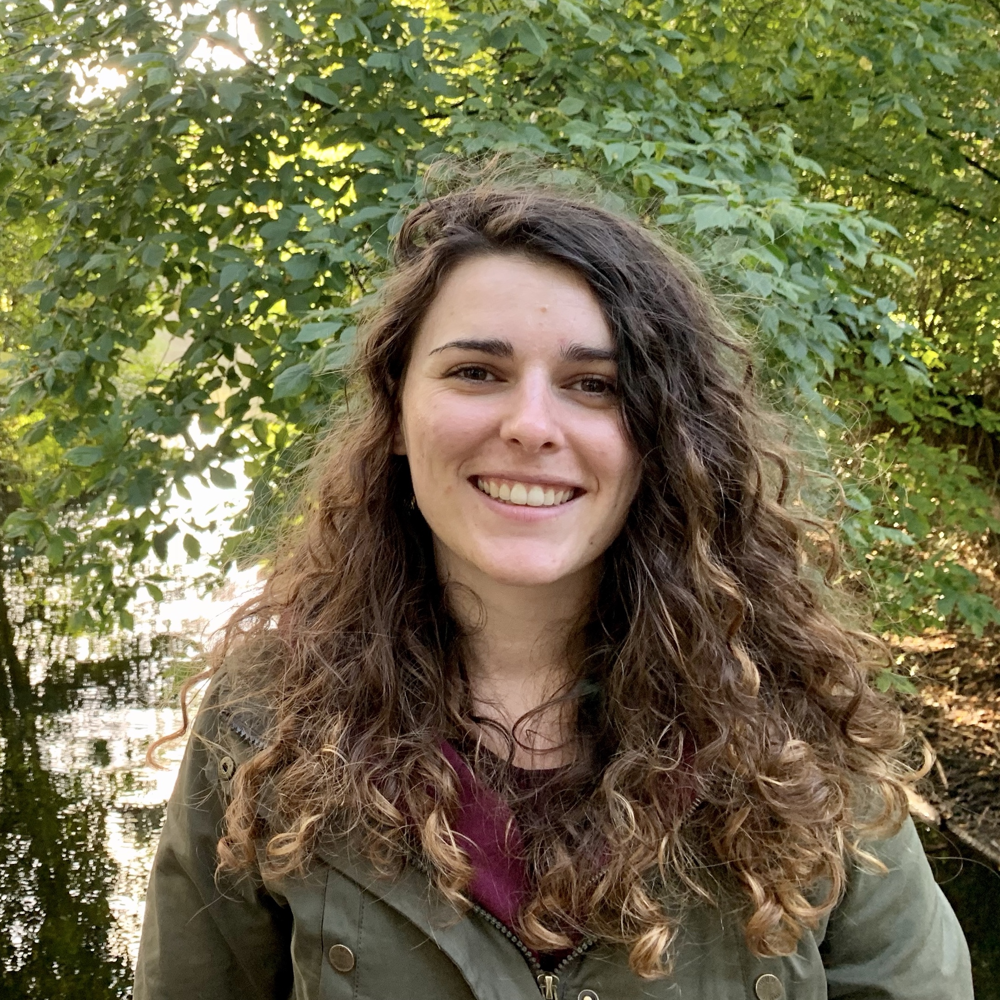

# Claire Sivadier

I’m a software engineer, focusing on IoT product development.

I started my iOS development career development student on the open Classrooms platform, working on various projects as: 

- [Instagrid](https://github.com/ClaireRimel/Projet-4-Instagrid) - App to share collage of pictures
- [ContOnMe](https://github.com/ClaireRimel/Projet-5-CountOnMe) - Simple calculator
- [Le Baluchon](https://github.com/ClaireRimel/Projet-9-Realisez-une-application-de-voyage) - Provide to travelers some features like a translator, convert and weather
- [Reciplease](https://github.com/ClaireRimel/Projet-10-Reciplease) - Help you to find receipes depending of which ingredients you have 

Today, I'm currently developing an application [UFConvertor](https://github.com/ClaireRimel/UFConvertorWidget).

Take a look at my [GitHub account](https://github.com/ClaireRimel), follow me on [Twitter](https://twitter.com/Claire_Rimel) or feel free to contact me via [email](mailto:sivadiercl@gmail.com).
